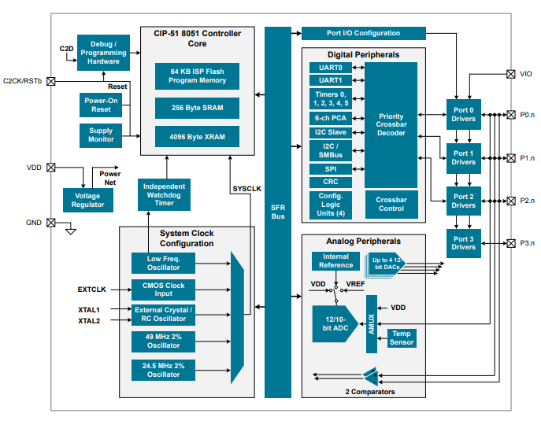

# [EFM8BB3](https://github.com/SoCXin/EFM8BB3)

*  [silabs](https://www.silabs.com/mcu/8-bit)：[8051](https://github.com/SoCXin/8051)
*  [Level](https://github.com/SoCXin/Level)：50MHz

## [简介](https://github.com/SoCXin/EFM8BB3/wiki)

[EFM8BB3](https://www.silabs.com/mcu/8-bit/efm8-busy-bee) 内置12位ADC可以监控USB TYEP-C接口的CC线，精确测量CC线上的压差，实现USB连接、拔除、传输方向的检测判断。ADC检测电流传感器、电压传感器实现过压保护，过流保护。EFM8BB3内置的逻辑单元（CLU）、模拟比较器、DAC方便和不同电源管理模块组合，实现电压的控制，监控，产品更加稳定可靠。

[EFM8BB3](https://github.com/SoCXin/EFM8BB3) 具有可现场升级的接口I2C，支持多种低功耗模式，极小封装满足空间要求苛刻的运用。Silicon labs公司可提供USB PD方案的参考原理图和运用代码，快速完成USB PD设计。

#### 关键特性

* 4*12bit数模转换器（DAC）
* 12bit高速模数转换器（ADC）
* 4路可配置逻辑单元（CLU）
#### 封装规格

* QFN32 (4x4mm)
* QFN24 (3x3mm)

### [资源收录](https://github.com/SoCXin/EFM8BB3)

* [参考文档](docs/)
* [参考资源](src/)
* [参考工程](project/)

### [选型建议](https://github.com/SoCXin)

[EFM8BB3](https://github.com/SoCXin/EFM8BB3)

###  [探索芯世界 www.SoC.xin](http://www.SoC.Xin)
